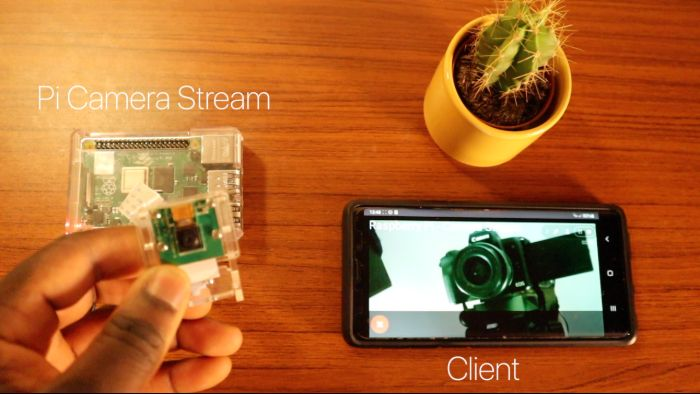
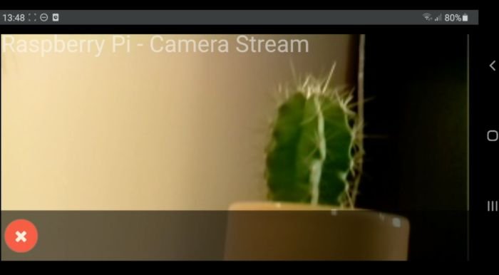

# piHeimdallr

*In Norse mythology, Heimdallr is a god who keeps watch for invaders and the onset of Ragnarök from his dwelling Himinbjörg, where the burning rainbow bridge Bifröst meets the sky.*

## What is piHeimdallr
This is a DIY-inspired home security system, designed to be used on a Raspberry Pi. 

## Features

| Feature       | Current Status |
| ------------- | -------------- |
| Access Video Stream in Browser | Done |
| Motion Detection  | Done  |
| Object Recognition  | In Development  |
| Alerting  | To Do  |
| Video Capture  | To Do  |
| Automatic Upload to Cloud  | To Do  |


## Screenshots
|  |  |
|---|---|
| Pi Setup | Pi - Live Stream |

## Before You Start

* Raspberry Pi 4, 2GB is recommended for optimal performance. Pi Zero W needs to be tested. The object recognition code might be too CPU intesnive, but this needs to be tested thoroughly. Also, there might be development improvements that could optimize this at a later date.
* Raspberry Pi 4 Camera Module or Pi HQ Camera Module (Newer version)
* Python 3.7 (there are dependancy issues with opencv-contrib-python with >3.7)
* Enable SSH on your pi
```
sudo systemctl enable --now ssh
```
* If you have created a new user to run this (recommended), ensure they are part of the "video" group
```
sudo usermod -aG video <username>
```

## Library dependencies
Install the following dependencies to create camera stream.

```
sudo apt update 
sudo apt upgrade
sudo apt install libatlas-base-dev libjasper-dev libqtgui4 libqt4-test libhdf5-dev -y

pip3 install -r requirements.txt
```

## Step 1 – Cloning piHeimdallr
Open up terminal and clone the piHeimdallr repo:

```
cd /home/pi
git clone https://github.com/blairhoddinott/piheimdallr.git
sudo mv piheimdallr /opt/
```

## Step 2 – Launch Web Stream

```
sudo python3 /opt/piheimdallr/main.py
```

## Step 3 – Autostart your Pi Stream

The most production-ready way to run this service, is via systemd. There is a sample config file in the docs directory.

There a couple modifications that need to be done:

```
vim docs/piheimdallr.service
```

Modify the *AssertPathExists* variable to point to your location of the pi-camera-stream-flask repo

If, like me, you are using pyenv for the virtual env, you will need to modify the ExecStart path to use the shim for your virtualenv. As an example, mine looks like:
```/home/<username>/.pyenv/versions/3.7.4/envs/stream_37/bin/python /opt/piheimdallr/main.py```

Once these modifications are done, save the file.

```
sudo cp docs/piheimdallr.service /etc/systemd/system/
sudo systemctl daemon-reload
sudo systemctl enable --now piheimdallr
```
